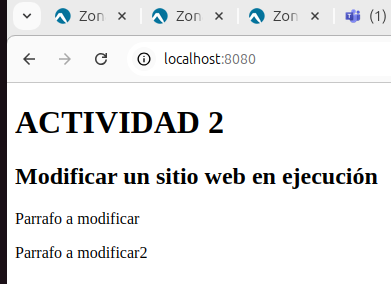

# Fundamentos de contenerización 

## Actividad 2. Modificar un sitio web en ejecución .

### Paso 1. Partimos de la imagen construida en la actividad anterior. 

### Paso 2. Ejecutar el contenedor en el puerto 8080, con el nombre actividad2, es importante montar el directorio actual del host en el directorio /usr/share/nginx/html/ dentro del contenedor. 
```
sudo docker run -d -p 8080:80 \
--name actividad2 \
--mount type=bind,source="$(pwd)",target=/usr/share/nginx/html \
107fcproyecto1:1.0

```

### Paso 3. Comprobación: http://localhost:8080 

 
### Paso 4. Se pide modificar el fichero index.html desde el host. 

 

### Paso 5. Se ha producido cambios , http://localhost:8080 
